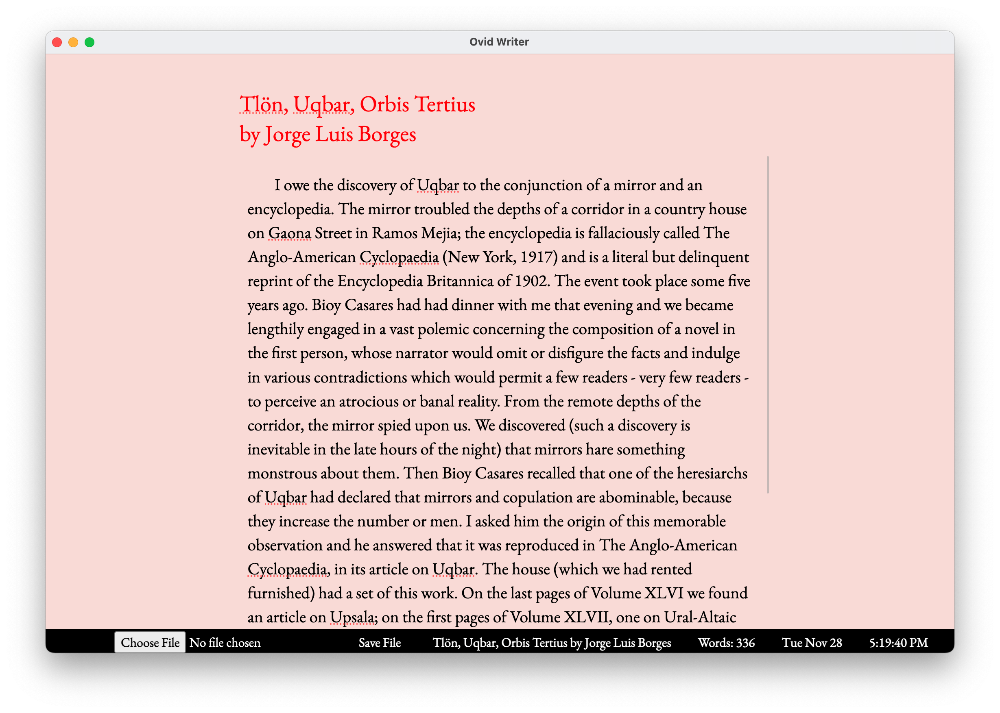

# Ovid Writer

Ovid Writer is a space for jotting down notes without distractions.

## Usage

Clone the project:

`$ git clone https://github.com/cspablocortez/OvidWriter.git`

Navigate to the project directory and run:

`$ python webapp/app.py`

Point browser to `localhost:3000`

## License

GNU General Public License v3.0